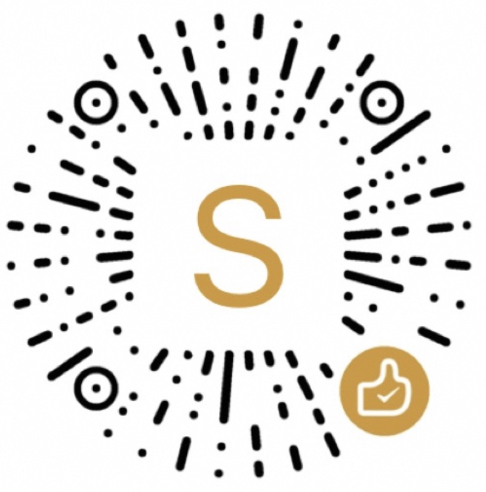

**Falcon** is a statically-typed, high-level programming language. It is designed to be a simple and easy-to-understand language for business purposes. The language is still in development and is **not ready for production use**. If you do not care about the risks, then please go ahead and try it out.

# Getting Started
Falcon is in early development, but we still prepare a simple [language manual](docs/manual.md) for aficionado.

You can check out the examples in the [src/test/](src/test/algorithm_test.go) directory. **This is also recommended approach to learn Falcon**.

# Build
> [!NOTE]
> **GCC toolchain is required** to build the project, because we rely on its assembler and linker.

`Linux+x86_64` is the official supported combination for now.
Other platforms may work, but are not tested/guaranteed.

Or simply use the `try.sh` script to compile and run the program:
```bash
$ ./try.sh
```

Before submiting your awesome patch, please at least run these tests:
```bash
$ ./test.sh
```

# Contribute

We welcome all contributions to the project. If you are interested in discovering
our new programming language features, compilers, or just want to help us improve the tests, documentation, or examples, please feel free to contribute. Here are some resources to get you started.

- [Compiler internals](docs/internal.md)
- [TODO list for contributors](docs/todo.md)
- General discussion: QQ group 285962642

# Authors
Thank you all for contributing to this project! They deserve my utmost admiration and gratitude. Please see full list of contributors at
[AUTHORS](docs/AUTHORS.md), again, thank you all!

# Sponsor
If you like this project, please consider sponsoring it. Your sponsorship will help us to continue to develop and maintain the project. If you dont mind, please leave your name and email address in the donation message or add to [AUTHORS/Sponsor section](docs/AUTHORS.md) directly. Thank you for your support!

